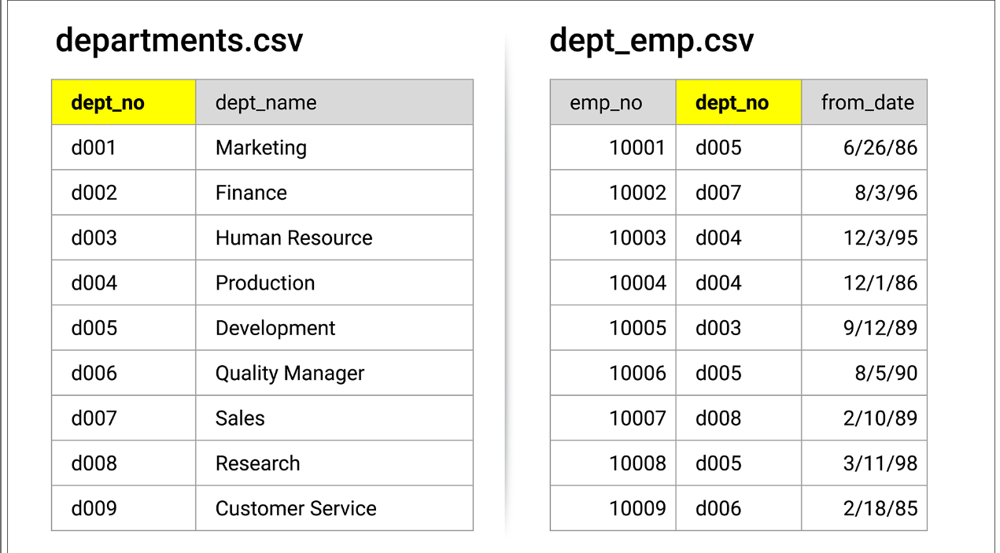
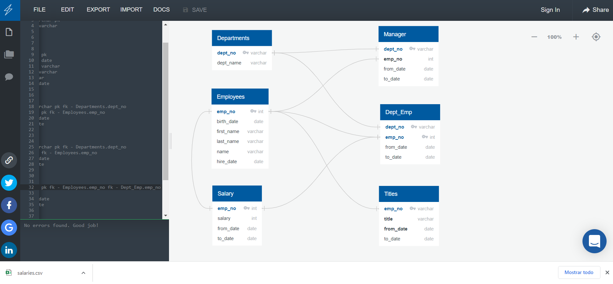
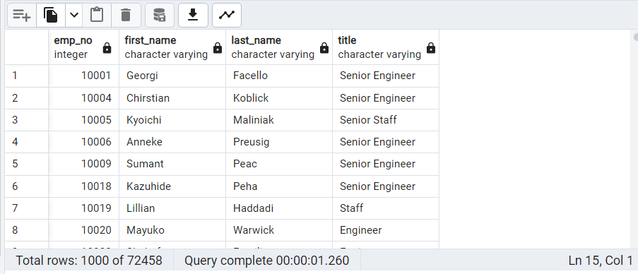

# Pewlett-Hackard-Analysis

# Introduction 
Databases are becoming more common worldwide and this is because we are creating more and more data each and everyday, a database is a collection of data of related data,
thanks to tools companies are able to understand a market tendencies, customer preferences and it´s own company structure.
We can see them in daily basis from making a deposit in a bank to make a airline reservation or even googling something it requieres a database.
With databases we are able to understand and represent some part of the world we are living ing (Geografical information systems, biological databases, etc.) and we can
make them as complex or simple as we need to so that´s why understanding the structure and learning how to use them has become a priority in our society.

Overview
====
Before getting into the analysis we need to understand that there is 2 main type of databases, SQL and NOSQL, SQL stands for Structured Query Lenguage and it started in
1970 as a solution for IBM for their quasirelational databases, it was up until 1979 that it was made available to the public and by the mid 80´s SQL was been used by
almost all the market so in 1986 the American National Standard realised the first SQL standard and from then on it has had some updates and it´s really common to see
them in the modern day. And just to mention them, NOSQL stands for Not Only SQL and the major difference is that they store information in JSON documents instead of the
typical columns and rows by relational databases.
# Analysis
Pewlett-Hackard is a big company with thousands of employees, and is looking into the future in 2 ways: 1) Counting how many people are going to retire and 2) because
there is a lot of people retiring there is going to be a lot of openings se we need to find candidates for a mentorship from the current employees.
For us to be able to understand how to proceed we needed to understand the connection between each csv file so after a thorough search we saw that they had what is
called a primary key (fig. 1), with this information we are able to connect all of the databases.

After recognizing all the primary and foreign keys (just like the primariies but from another database) we created a Entity Relationship Diagram or ERD to representate 
the relationship between each other

And this is where we enter SQL, I personally use postgressSQL v.11..17.1 but this my personal choice, there is more advanced version if you want to try them, in
pgAdming we created the commands to insert tables and specify the type of data for each column, after that we inserted the tables manually from the option
Import/Export Data when you right click a table and we got to work.

First of all we calculated the total of people that will leave the company in the years to come, for this we aproximated that the people born in between the years 1952
and 1955 will be the first ones leaving so we focused on them and with the code

'$SELECT e.emp_no,
       e.first_name,
       e.last_name,
       t.title,
       t.from_date,
       t.to_date
INTO retirement_titles
FROM employees as e
INNER JOIN titles as t
ON (e.emp_no = t.emp_no)
WHERE (e.birth_date BETWEEN '1952-01-01' AND '1955-12-31')
order by e.emp_no;
'
we filter them and realized that they where duplicates because of some people getting promoted so to make sure we eliminated the duplicates we implemented the code

'$ SELECT DISTINCT ON (emp_no) emp_no,
first_name,
last_name,
title
INTO unique_titles
FROM retirement_titles
WHERE to_date BETWEEN '9999-01-01' AND '9999-01-01'
ORDER BY emp_no, to_date DESC;
`
and for the last part we wanted to see how many openings by position will have to be filled so we used the code 

'$
SELECT COUNT(title), title
INTO retiring_titles
FROM unique_titles
GROUP BY title 
ORDER BY COUNT(titlyppe) DESC
'

and with this we had the answer for the first question and for the second one we had it easier, knowing now that there are duplicates in the database we filter them from the beginning and from there we just needed to decide wichh persons where able to take the opportunity, so we tought that the best way was to choose the people born in the year 1965 because some of the positions where high ranked and we needed people with experience, so for this we used the code 

'$SELECT DISTINCT ON(e.emp_no) e.emp_no, 
e.first_name, e.last_name, e.birth_date,
ti.title, de.from_date, de.to_date
INTO mentorship_elegibility
FROM employees as e
INNER JOIN titles as ti
ON (e.emp_no = ti.emp_no) 
INNER JOIN dept_emp as de
ON (e.emp_no = de.emp_no)
WHERE e.birth_date BETWEEN '1965-01-01' AND '1965-12-31'
ORDER BY e.emp_no
'

Results
===
We found the total employees retiring and the position opening up, also the elegible employees for the mentorship:
- 133,776 total employees without filter
- 72,458 total employees
- Senior Engineer was the position with more people retiring from with a total of 25,916
- 1,940 total employees eligible for the mentorship

The total employees is not as big as we tought at first because almost half of them had a promotion changing the title they had creating duplicates, that is a 
inefficient way to store data creating confussion. 

If we look at fig 3. we can see that there is a total of 72,458 (as mention before) that enter the range of people retiring, this can be an issue to the company 
being such a large number, and if we compare the people that can enter the mentorship we can see that it is nothing (0.0026%) so the company must have work fair or
something like that to be able to replenish the positions.

